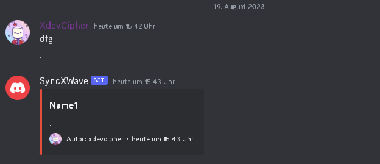

# Discord-Announcement-Bot

This is a simple Discord bot that posts messages in specific channels in the form of embeds.

## Functionality

The bot monitors certain channels for messages from users. When a message is received, the content of the message is formatted into an embed and posted in the same channel. The bot supports configuring multiple channels and their titles.

pip install -r requirements.txt

Run the bot script: python bot.py
